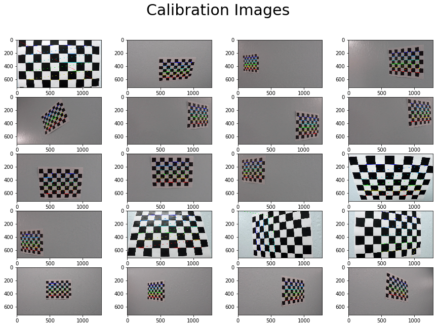
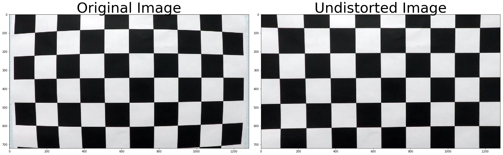
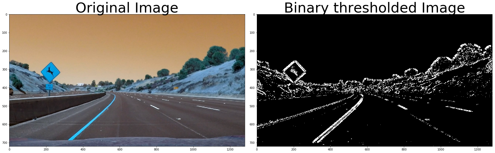
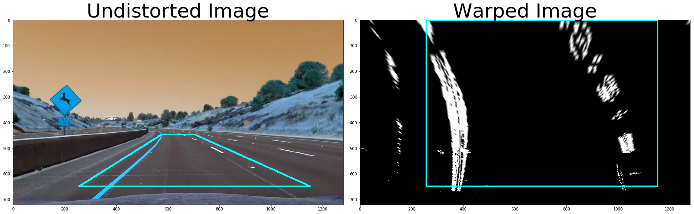
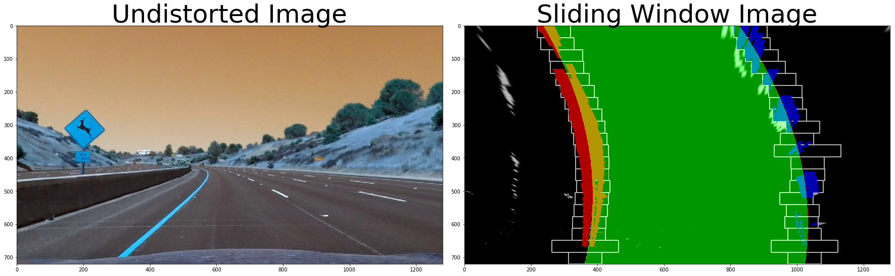
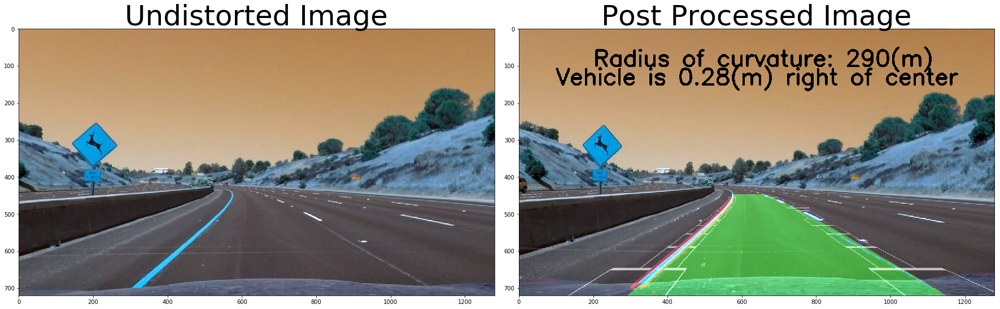

## Advanced Lane Finding Project

The goals / steps of this project are the following:

* Compute the camera calibration matrix and distortion coefficients given a set of chessboard images.
* Apply a distortion correction to raw images.
* Use color transforms, gradients, etc., to create a thresholded binary image.
* Apply a perspective transform to rectify binary image ("birds-eye view").
* Detect lane pixels and fit to find the lane boundary.
* Determine the curvature of the lane and vehicle position with respect to center.
* Warp the detected lane boundaries back onto the original image.
* Output visual display of the lane boundaries and numerical estimation of lane curvature and vehicle position.

---
## First, I computed the camera calibration using chessboard images

I looped over the 20 calibration images provided with the project. On each image, I tried different grid size options starting with the largest grid until cv2.findChessboardCorners() was able to accurately detect internal chessboard corners on the image. I maintained two lists - first, a list of object points which contains the indices of the chessboard corners, and second, a list of image points containing the actual pixel location of the detected corner in the calibration image.

## Compute and apply distortion correction

I then applied cv2.calibrateCamera() method to obtain the calibration matrix. I applied the calibration matrix to undistort a sample image. The original image and the undistorted image are plotted below.

## Create binary thresholded image for a test image

I used the R- and S- components of the image for binary thresholding. I applied a Sobel kernel of size 7 in both x- and y- direction to these components. Next, I used empirically determined thresholds for the absolute values, magnitude and direction of the gradients to create my binary thresholded image.

## Apply birds eye view perspective transform

I visually examined the binary thresholded image to obtain a reasonable warping transformation. The boundaries for the quadilateral in the original and warped images are shown in the figures below.

# Apply sliding window

I applied the sliding window technique as presented in the course. I added the following modifications to improve the robustness and speed of detection.

I restricted the search for the sliding window position based on the window position located in the previous frame, as well the window position of the immediate neightbour window. I also discard window positions which lead to inconsistent curvature and offset values from previous frames as well as with respect to the opposing lane-line. In such cases, the lane line estimate is kept unchanged from it's previous value. If the lane line was not detected with confidence for two consecutive frame, I discard previously recorded lane metrics, and re-search the image to obtain fresh estimates for window positions and lane curves. To speed up window detection, I further restric the margin of window search to +/- 50 pixels in the neighbourhood of a previously detected window which had high confidence. If not neighbouring window was detected, I widen the search margin to +/- 100 pixels. 

## Unwarp image to original view

## Post process the image and add text for curvature and offset

## Apply image processing pipeline

Create a pipeline for image processing which performs the following steps:

1. Undistort
2. Binary Threshold
3. Warp
4. Apply Sliding Window
5. Unwarp
6. Superpose lane with original image
7. Add curvature and lane-offset information

## Apply pipeline to movie stream

    [MoviePy] >>>> Building video project_video_output.mp4
    [MoviePy] Writing video project_video_output.mp4
    

    100%|████████████████████████████████████████████████████████████████████████████████████████████████████████████████████████████████████████████████████████████████████████████████████████████████████████████████████████████████████▊| 1260/1261 [08:43<00:00,  2.38it/s]
    

    [MoviePy] Done.
    [MoviePy] >>>> Video ready: project_video_output.mp4 
    
    Wall time: 8min 44s
    
